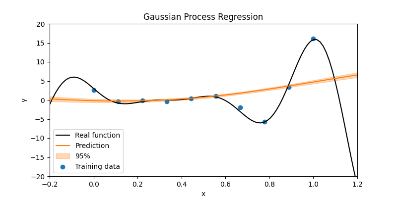

# Gaussian Process Regression

The following figure demonstrates the training steps for Gaussian Process Regression. To this end the negative logarithm of the marginal likelihood is minimzied. 

Code can be found in `gaussian_process_regression.py`.

This project is based on an assignment from the lecture [Probabilistic Machine Learning](https://www.youtube.com/playlist?list=PL05umP7R6ij1tHaOFY96m5uX3J21a6yNd) at the [University of Tübingen](https://uni-tuebingen.de/).